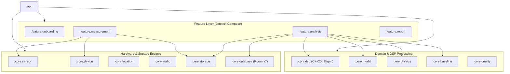

<div align="center">

# PhoneSHM
### Sovereign, Citizen-Scale Android Structural Health Monitoring (SHM) Platform

[](https://www.android.com)
[](https://kotlinlang.org)
[](https://isocpp.org)
[](https://eigen.tuxfamily.org)
[](https://developer.android.com/jetpack/compose)
[-009688.svg?style=flat)](https://developer.android.com/training/data-storage/room)
[](#testing--verification)

[Architecture](docs/ARCHITECTURE.md) • [DSP & OMA Specification](docs/DSP_AND_MODAL_ANALYSIS.md) • [Baseline & Physics](docs/BASELINE_AND_PHYSICS.md) • [Data Formats](docs/DATA_FORMATS.md) • [Legacy Archive](docs/archive/phoneshm_implementation_plan_v1.2.md)

</div>

---

## 📌 Executive Overview

**PhoneSHM** is an open-source, research-grade Android application designed to transform everyday consumer smartphones into distributed, autonomous sensors for **Structural Health Monitoring (SHM)** and **Operational Modal Analysis (OMA)**.

Ambient environmental vibrations (wind excitation, micro-tremors, traffic loading) induce subtle structural oscillations in buildings and civil infrastructure. PhoneSHM records these ambient vibrations at $100\text{ Hz}$ using low-cost onboard MEMS accelerometers, tracks clock jitter and sensor drift, executes high-performance C++20 modal analysis algorithms directly on the edge, validates natural frequencies against structural engineering building codes (Eurocode 8 / ASCE 7), and tracks structural stiffness degradation over time using online Welford statistics.

---

## ⚡ Key Capabilities

### 1. Tri-Engine Operational Modal Analysis (OMA)
To reliably identify fundamental resonant frequencies ($f_0$) and mode shapes without artificial actuators, PhoneSHM runs three complementary algorithms in parallel:
- **Welch Power Spectral Density (PSD)**: Averaged modified periodogram with $1024$-point FFT, $50\%$ Hanning overlap, logarithmic parabolic sub-bin interpolation, and zero-allocation C++ scratch buffers.
- **Enhanced Frequency Domain Decomposition (EFDD)**: High-performance C++ JNI bridge using Eigen 3.4 SVD. Constructs the $3 \times 3$ cross-spectral density matrix $\mathbf{G}_{yy}(f)$ and tracks the first singular value line spectrum ($s_1$) and damping ratios ($\zeta$).
- **Multi-Channel RDT-SSI (Time Domain)**: Multi-channel Random Decrement Technique (10 positive-slope trigger levels) extracting free decay signatures, followed by Block Hankel SVD Stochastic Subspace Identification to extract state-space continuous poles.
- **Tri-Engine Consensus Engine**: Autonomous clustering across Welch, EFDD, and SSI candidates using a $5\%$ structural tolerance window, yielding explicit consensus states (`AGREED`, `PARTIAL`, `DISAGREED`, `INSUFFICIENT`).

### 2. Physics-Based Structural Validation
Detected frequencies are checked against empirical structural dynamics formulas for building archetypes (Reinforced Concrete, Steel Frame, Timber/Wood, and Masonry Shear Walls) to categorize modes into:
- `GLOBAL_MODE`: Plausible fundamental vibration mode of the superstructure.
- `LOCAL_MODE`: Floor diaphragm bending or localized component vibration.
- `SENSOR_ARTIFACT`: Electrical mains hum ($50\text{Hz}/60\text{Hz}$), high-frequency motor noise, or DC drift.

### 3. Longitudinal Baseline & Environmental Stratification
- **Online Welford Statistics**: Maintains running mean ($\mu$) and standard deviation ($\sigma$) with zero unbounded memory growth.
- **Baseline Lifecycle**: 10-session calibration baseline followed by active operational monitoring.
- **Anomaly Protection**: Automatically flags structural frequency shifts $|\Delta f_0\%| > 5.0\%$ and excludes anomalous sessions from contaminating healthy baseline statistics.
- **Thermal Stratification**: Records battery temperature (ambient proxy) and diurnal time windows (`MORNING`, `AFTERNOON`, `EVENING`, `NIGHT`) to eliminate false alarms caused by seasonal and diurnal thermal expansion cycles.

### 4. Zero ANR Concurrency & Hardware Precision
- **Threading Separation**: DSP calculations and JNI matrix decompositions run exclusively on `Dispatchers.Default`, file and database operations on `Dispatchers.IO`, and Compose UI on `Dispatchers.Main`.
- **Clock Jitter & Drift Tracking**: Measures hardware timestamp delta standard deviation (`sampleJitterStdMs`) and hardware oscillator drift (`clockDriftPpm`).
- **Research Interoperability**: Every completed session automatically mirrors raw binary data (`.bin`) and metadata (`.meta.json`) to `/sdcard/Download/PhoneSHM/` for root-free analysis via Termux, Python, or MATLAB.

---

## 🏛 Architecture & Module Topology

PhoneSHM follows strict Clean Architecture across **14 isolated Gradle modules**:



Detailed architectural diagrams and sequence flows can be found in [docs/ARCHITECTURE.md](docs/ARCHITECTURE.md).

---

## 📁 Repository Structure

```text
ronin_shm/
├── app/                  # Application host, MainActivity, Compose NavHost
├── core/
│   ├── audio/            # Circular RAM buffer for acoustic context
│   ├── baseline/         # Longitudinal Welford baseline manager & anomaly engine
│   ├── database/         # Room Database (v7) with schema export & migrations
│   ├── device/           # Zero-velocity calibration & capability classification
│   ├── dsp/              # C++20 native DSP (Eigen SVD, Welch, EFDD, RDT-SSI, JNI)
│   ├── location/         # Privacy-tier LocationResolver & building_hash generator
│   ├── modal/            # Peak finder, sub-bin interpolation & ModalConsensusEngine
│   ├── physics/          # Civil engineering period heuristics & plausibility rules
│   ├── quality/          # 4-factor measurement quality score fusion
│   ├── sensor/           # 100Hz hardware sensor engine, jitter & clock drift
│   └── storage/          # Binary file streaming (.bin) & atomic writer
├── feature/
│   ├── analysis/         # Tri-engine modal identification & consensus UI
│   ├── measurement/      # Live 100Hz recording HUD & dynamic calibration
│   ├── onboarding/       # 4-step building profile & multi-location setup
│   └── report/           # Citizen Science summary & Senior Engineer diagnostics
├── docs/                 # Detailed system documentation
│   ├── ARCHITECTURE.md
│   ├── DSP_AND_MODAL_ANALYSIS.md
│   ├── BASELINE_AND_PHYSICS.md
│   ├── DATA_FORMATS.md
│   └── archive/          # Historical/legacy implementation plans
├── firestore.rules       # Hardened Firebase security rules
└── tools/                # Administrative & data migration scripts
```

---

## 🛠 Tech Stack & Dependencies

| Layer | Technology | Details |
| :--- | :--- | :--- |
| **Language** | Kotlin 1.9.24 / C++20 | Modern idiomatic Kotlin with coroutines & native C++ math routines. |
| **UI Framework** | Jetpack Compose | Material 3, Navigation state preservation (`rememberSaveable`, `BackHandler`). |
| **DSP / Math** | Eigen 3.4.0 / KissFFT | Native SVD (`BDCSVD`), thin decomposition, and zero-allocation scratch buffers. |
| **Database** | Room v7 (SQLite) | B-tree indexed queries, foreign keys, schema JSON export, non-destructive migrations. |
| **Cloud Sync** | Firebase Firestore / Storage | UID-authenticated session sync and deletion requests. |
| **Minimum SDK** | Android 8.0 (API 26) | Target SDK 34 (Android 14). |

---

## 🚀 Getting Started

### Prerequisites
- **Android Studio** Hedgehog (2023.1.1) or newer
- **Android SDK** API 34
- **Android NDK** 26.1.10909125+
- **CMake** 3.22.1+
- **JDK** 17

### Building via Command Line
```bash
# Clone the repository
git clone https://github.com/intellibits28/PhoneSHM.git
cd PhoneSHM

# Compile all Kotlin modules
./gradlew compileDebugKotlin

# Assemble Debug APK
./gradlew assembleDebug
```

### On-Device Build via Termux
PhoneSHM supports local compilation directly on physical ARM64 Android devices running Termux:
```bash
# Verify native clang++ and cmake
clang++ --version
cmake --version

# Run full project unit test suite
./gradlew testDebugUnitTest
```

---

## 🧪 Testing & Verification

PhoneSHM enforces strict unit and integration test coverage across all 14 modules:
- **Modal Consensus Suite**: [`ModalConsensusEngineTest.kt`](core/modal/src/test/kotlin/com/ronin/phoneshm/core/modal/ModalConsensusEngineTest.kt) validates `AGREED`, `PARTIAL`, `DISAGREED`, `INSUFFICIENT`, and multi-mode cluster selection.
- **Baseline Lifecycle Suite**: Validates Welford running variance, 10-session calibration transitions, and $\pm 5\%$ anomaly alerts.
- **Physics Rule Suite**: Validates structural period envelopes across Concrete, Steel, Wood, and Masonry models.
- **Hardware Metrics Suite**: Validates monotonic timestamp enforcement, jitter std deviation, and clock drift PPM.

Run the test suite across all modules:
```bash
./gradlew testDebugUnitTest
```

---

## 📄 Data Formats & Interoperability

PhoneSHM streams acceleration samples into 20-byte little-endian binary frames (`timestamp_ns`, `x`, `y`, `z`) accompanied by `.meta.json` sidecar files containing sensor noise floors, device capabilities, and environmental conditions.

Complete specification and parsing examples in Python are available in [docs/DATA_FORMATS.md](docs/DATA_FORMATS.md).

---

## 📚 References & Academic Citations

1. **Brincker, R., Zhang, L., & Andersen, P. (2001).** *Modal identification of output-only systems using frequency domain decomposition.* Smart Materials and Structures, 10(3), 441.
2. **Van Overschee, P., & De Moor, B. (1996).** *Subspace Identification for Linear Systems: Theory—Implementation—Applications.* Kluwer Academic Publishers.
3. **Cole, H. A. (1973).** *On-line failure detection and damping measurement of aerospace structures by random decrement signatures.* NASA CR-2205.
4. **Eurocode 8 (EN 1998-1:2004).** *Design of structures for earthquake resistance - Part 1: General rules, seismic actions and rules for buildings.*
5. **ASCE/SEI 7-22.** *Minimum Design Loads and Associated Criteria for Buildings and Other Structures.* American Society of Civil Engineers.

---

## 📜 License

PhoneSHM is open-source software licensed under the [Apache License 2.0](LICENSE).
