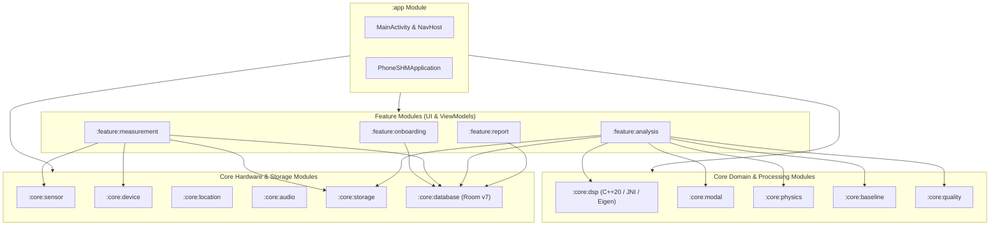
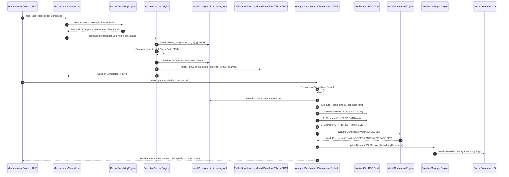
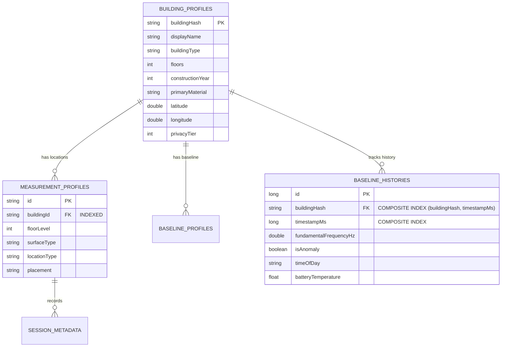

# PhoneSHM Architecture & System Blueprint

## 1. System Overview

**PhoneSHM** is a sovereign, citizen-scale Android native Structural Health Monitoring (SHM) platform. It enables commodity smartphones to perform research-grade ambient vibration measurements and Operational Modal Analysis (OMA) on civil infrastructure (buildings, bridges, timber, reinforced concrete, and steel structures).

The platform transforms low-cost MEMS accelerometers into high-fidelity structural sensors by combining:
- Hardware-accurate timestamp jitter and drift compensation.
- Multi-channel digital signal processing (Welch PSD, C++ SVD-based EFDD, and C++ RDT-SSI).
- Physics-based validation against structural engineering design codes (Eurocode 8, ASCE 7).
- Environmental stratification (diurnal temperature and time-of-day tracking) with online Welford baseline anomaly detection.

---

## 2. Multi-Module Architecture

The repository is structured into **14 decoupled Gradle modules** adhering strictly to Clean Architecture and MVVM design patterns:



### Module Responsibilities

| Module | Responsibilities |
| :--- | :--- |
| `:app` | Application bootstrap, Compose navigation host, dynamic ViewModel factories, and system back-stack handling. |
| `:feature:onboarding` | 4-step building profile wizard, multi-measurement location manager, and building metadata validation. |
| `:feature:measurement` | Real-time 100Hz vibration acquisition HUD, live RMS vibration meter, per-session dynamic sensor calibration, and local session history. |
| `:feature:analysis` | Tri-engine modal identification execution (Welch PSD + EFDD + RDT-SSI), consensus status visualization, singular value spectrum, and baseline anomaly comparison. |
| `:feature:report` | Dual-mode presentation: Citizen Science executive summary vs. Senior Structural Engineer interactive diagnostics. |
| `:core:dsp` | High-performance C++20 DSP engine with JNI bindings: Eigen 3.4 SVD, FFT, Welch PSD, Enhanced Frequency Domain Decomposition (EFDD), and Multi-Channel Stochastic Subspace Identification (RDT-SSI). |
| `:core:modal` | Peak extraction, sub-sample parabolic interpolation, adaptive peak persistence tracking, and Tri-Engine Modal Consensus Engine. |
| `:core:physics` | Structural design period heuristics ($T = C_t H^{3/4}$), plausibility boundaries, and frequency categorization (`GLOBAL_MODE`, `LOCAL_MODE`, `SENSOR_ARTIFACT`). |
| `:core:baseline` | Online Welford longitudinal baseline tracking ($\mu, \sigma^2$), 10-session baseline calibration, structural anomaly thresholding ($\pm 5\%$), and environmental stratification. |
| `:core:quality` | 4-factor multi-metric measurement quality score fusion (Sensor capability, Noise floor, Surface coupling stability, Frequency peak prominence). |
| `:core:sensor` | Hardware sensor acquisition, monotonic timestamp verification, clock jitter calculation (`sampleJitterStdMs`), clock drift tracking (`clockDriftPpm`), and background recording service. |
| `:core:device` | Device capability classification (MEMS noise floor estimation, zero-velocity bias calibration, tier classification: `RESEARCH_GRADE`, `GOOD`, `FAIR`, `POOR`). |
| `:core:storage` | High-throughput binary file streaming (`.bin` format with 20-byte sample frames) and atomic file finalization. |
| `:core:database` | Room database (Version 7) with schema export, foreign keys, query indices, and non-destructive migrations (`MIGRATION_6_7`). |
| `:core:location` | Privacy-preserving GPS and network location resolver, generating immutable crowdsourced `building_hash` fingerprints. |
| `:core:audio` | Privacy-preserving circular RAM audio context buffer ($-2\text{s}$ to $+3\text{s}$ surrounding vibration events), zero raw audio disk storage. |

---

## 3. End-to-End Data Pipeline



---

## 4. Concurrency & Threading Model

To prevent Android Application Not Responding (ANR) dialogs and 60/120 FPS UI dropped frames, PhoneSHM enforces strict thread boundary separation:

1. **`Dispatchers.Main`**:
   - Solely responsible for Jetpack Compose UI rendering, state observers (`collectAsState`), and user interactions.
   - Preserves state across configuration changes (e.g. screen rotation) using `rememberSaveable`.
   - Intercepts system back navigation via `BackHandler`.

2. **`Dispatchers.Default`**:
   - Dedicated thread pool for CPU-bound computations:
     - Monotonic timestamp verification and linear interpolation resampling.
     - Exponential moving average (EMA) gravity estimation and linear detrending.
     - JNI bridge array marshalling and native C++ execution (Welch FFT, SVD decompositions, Hankel matrices).
     - Multi-candidate modal clustering and consensus determination.

3. **`Dispatchers.IO`**:
   - Dedicated thread pool for disk and network I/O:
     - Streaming sensor batches to `.bin` storage.
     - Writing sidecar `.meta.json` metadata files.
     - Room database SQLite queries and transactions.
     - Scoped storage mirroring via `MediaStore` API.

---

## 5. Persistence & Schema Governance

### Room Database Architecture (Version 7)
PhoneSHM utilizes Android Jetpack Room with full schema export enabled (`schemas/.../7.json`) and non-destructive migrations:



#### Migration History
- **Version 1-5**: Initial schemas for building profiles, raw sessions, and basic baselines.
- **Version 6**: Added multi-location measurement profile tables and environmental fields.
- **Version 7**: Added explicit B-tree indices on `MeasurementProfileEntity.buildingId` and composite indices on `BaselineHistoryEntity(buildingHash, timestampMs)` via `MIGRATION_6_7`.

---

## 6. Security & Cloud Synchronization

- **Client Ownership Validation**: Firestore rules enforce strict user UID matching:
  ```javascript
  match /sessions/{sessionId} {
    allow create: if request.auth != null && request.resource.data.firebaseAuthUid == request.auth.uid;
    allow read, update, delete: if request.auth != null && resource.data.firebaseAuthUid == request.auth.uid;
  }
  ```
- **Privacy-Preserving Deletion**: Cloud deletion requests in `/deletionRequests/{requestId}` require matching authenticated UIDs, preventing unauthorized deletion of structural records.
- **Location Obfuscation**: User location coordinates can be generalized based on privacy tiers (Exact, 100m blur, or City level) before generating the immutable SHA-256 `building_hash`.
- **Zero Raw Audio Storage**: The circular audio context buffer operates entirely in volatile RAM memory; acoustic features are extracted without writing raw microphone audio to storage.
