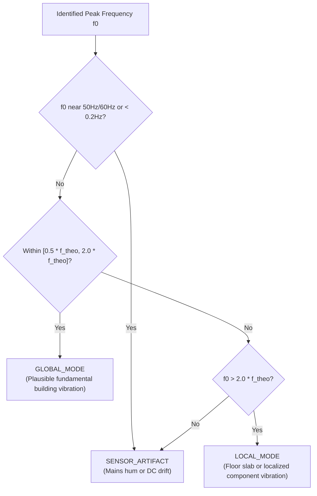
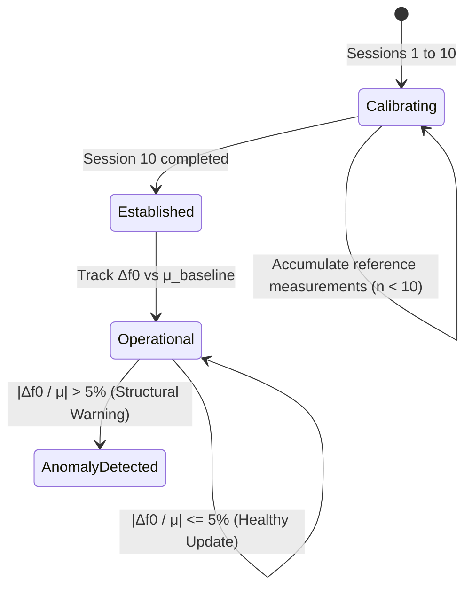

# Baseline Tracking & Physics-Based Validation

## 1. Physics-Based Domain Classification

Civil structures oscillate according to structural dynamics dictated by their mass, stiffness, geometry, and material damping. Ambient measurements from low-cost smartphones often pick up unrelated environmental vibrations (footsteps, elevator motors, HVAC equipment, and electrical mains hum). 

To ensure measurement integrity, **PhoneSHM** integrates domain physics models from civil engineering building codes (Eurocode 8 / EN 1998-1, ASCE 7-22) into [`core/physics`](file:///data/data/com.termux/files/home/play-ground/ronin_shm/core/physics/src/main/kotlin/com/ronin/phoneshm/core/physics/PhysicsRuleEngine.kt).

---

### A. Empirical Structural Period & Frequency Formulations
The theoretical fundamental period $T_1$ (seconds) and natural frequency $f_0$ (Hz) of a building with height $H$ (meters) or number of storeys $N$ are estimated using standard empirical equations:
$$T_1 = C_t \cdot H^{3/4}, \quad f_{0, \text{theo}} = \frac{1}{T_1}$$
where $H \approx N \cdot h_{\text{storey}}$ (assuming nominal floor height $h_{\text{storey}} \approx 3.0\text{ m}$ to $3.5\text{ m}$).

| Structural Archetype | Material Coefficient ($C_t$) | Typical Fundamental Period $T_1$ | Expected Fundamental Frequency Range |
| :--- | :--- | :--- | :--- |
| **Moment-Resisting Steel Frame** | $C_t \approx 0.085$ | $T \approx 0.085 H^{3/4}$ | $0.2\text{ Hz} - 8.0\text{ Hz}$ |
| **Reinforced Concrete (RC) Frame**| $C_t \approx 0.075$ | $T \approx 0.075 H^{3/4}$ | $0.3\text{ Hz} - 12.0\text{ Hz}$ |
| **Timber / Wood Frame** | $C_t \approx 0.050$ | $T \approx 0.050 H^{3/4}$ | $1.5\text{ Hz} - 25.0\text{ Hz}$ |
| **Masonry / Concrete Shear Wall** | $C_t \approx 0.050$ | $T \approx 0.050 H^{3/4}$ | $1.0\text{ Hz} - 20.0\text{ Hz}$ |

### B. Classification Categories

1. **`GLOBAL_MODE`**:
   - The detected frequency falls squarely within the physical resonance envelope $[0.5 \cdot f_{0, \text{theo}}, 2.0 \cdot f_{0, \text{theo}}]$ for the declared structural material and height.
   - Represents the true global fundamental translation or torsional oscillation mode of the superstructure.
2. **`LOCAL_MODE`**:
   - The detected frequency is higher than the global envelope but corresponds to physical floor diaphragm bending, partition resonance, or machinery excitation.
3. **`SENSOR_ARTIFACT`**:
   - Spurious peaks corresponding to electrical grid noise ($50.0\text{ Hz} \pm 0.5\text{ Hz}$ or $60.0\text{ Hz} \pm 0.5\text{ Hz}$), high-frequency acoustic feedback ($> 45\text{ Hz}$), or DC drifting ($< 0.2\text{ Hz}$).

---

## 2. Longitudinal Baseline Manager Engine

A building's structural integrity is monitored by tracking long-term shifts in its fundamental frequency $f_0$. Structural stiffness degradation (e.g. earthquake micro-cracking, joint fatigue, subsidence) directly causes a downward shift in natural frequency:
$$f_0 = \frac{1}{2\pi}\sqrt{\frac{K}{M}} \implies \Delta K \approx 2 \cdot \frac{\Delta f_0}{f_0}$$

### A. Welford Online Variance Algorithm
To maintain numerical precision and avoid unbounded memory growth over months of measurements, [`DefaultBaselineManagerEngine.kt`](file:///data/data/com.termux/files/home/play-ground/ronin_shm/core/baseline/src/main/kotlin/com/ronin/phoneshm/core/baseline/DefaultBaselineManagerEngine.kt) computes the running mean $\mu$ and standard deviation $\sigma$ using Welford's algorithm:
$$\mu_n = \mu_{n-1} + \frac{x_n - \mu_{n-1}}{n}$$
$$M_{2, n} = M_{2, n-1} + (x_n - \mu_{n-1})(x_n - \mu_n)$$
$$\sigma_n = \sqrt{\frac{M_{2, n}}{n - 1}}$$

### B. Two-Phase Baseline Lifecycle

1. **Calibration Phase ($n < 10$)**:
   - During the first 10 sessions, PhoneSHM accumulates baseline data to establish natural environmental variability.
   - The UI indicates `CALIBRATING BASELINE (n/10)` with the current running mean and standard deviation.
2. **Operational Tracking Phase ($n \ge 10$)**:
   - The established baseline $(\mu_{\text{base}}, \sigma_{\text{base}})$ serves as the golden reference.
   - For every new session:
     $$\Delta f_0\% = \frac{f_{\text{current}} - \mu_{\text{base}}}{\mu_{\text{base}}} \times 100\%$$
   - **Safety Threshold ($\pm 5.0\%$)**: If $|\Delta f_0\%| > 5.0\%$, an anomaly alert is raised (`isAnomaly = true`).

### C. Anomaly Exclusion (Safe Baseline Protection)
When an anomaly is detected ($|\Delta f_0\%| > 5.0\%$), PhoneSHM **does not** incorporate the anomalous measurement into the healthy baseline statistics $(\mu_{\text{base}}, \sigma_{\text{base}})$. This prevents corrupted measurements (e.g. phone touched during recording, construction noise) from drifting the true baseline reference.

---

## 3. Environmental Stratification

Temperature fluctuations alter structural stiffness through thermal expansion, joint friction, and changing concrete/timber elastic moduli ($E$). Without environmental correction, temperature cycles cause diurnal frequency fluctuations of $1\% - 3\%$, triggering false positive structural alarms.

PhoneSHM counters this by capturing environmental metadata with each session:
1. **Battery Temperature ($T_{\text{batt}}$)**:
   - Acquired via `BatteryManager.EXTRA_TEMPERATURE` at session completion.
   - Serves as an accurate proxy for indoor/outdoor ambient temperature.
2. **Diurnal Time-of-Day Stratification**:
   - Categorized into 4 discrete temporal windows:
     - `MORNING` (05:00 - 11:59)
     - `AFTERNOON` (12:00 - 16:59)
     - `EVENING` (17:00 - 20:59)
     - `NIGHT` (21:00 - 04:59)
   - Allows baseline comparisons to be stratified against identical thermal windows, isolating genuine structural damage from natural thermal diurnal cycles.
