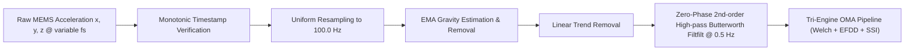
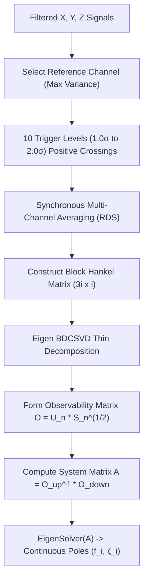

# Operational Modal Analysis (OMA) & DSP Specification

## 1. Mathematical & Engineering Foundations

Smartphone MEMS accelerometers inherently operate with variable sampling intervals, analog-to-digital converter quantization noise, thermal drift, and baseline DC gravity offsets ($1g \approx 9.80665\text{ m/s}^2$). 

**PhoneSHM** solves these physical constraints through a three-stage mathematical pipeline:
1. **Deterministic Preprocessing**: Monotonic time validation, cubic/linear resampling to $100.0\text{ Hz}$, gravity vector subtraction via exponential moving average (EMA), and zero-phase Butterworth filtering.
2. **Tri-Engine Modal Identification**:
   - **Method 1 (Frequency Domain)**: Welch's Method Power Spectral Density (PSD) with sub-bin parabolic interpolation.
   - **Method 2 (Spatial/Frequency Domain)**: Enhanced Frequency Domain Decomposition (EFDD) via Singular Value Decomposition (SVD) of the 3-axis spectral matrix.
   - **Method 3 (Time Domain)**: Multi-Channel Random Decrement Technique with Data-Driven Stochastic Subspace Identification (RDT-SSI).
3. **Tri-Engine Modal Consensus**: Autonomous clustering across candidates to eliminate spurious ambient noise and identify true structural natural frequencies ($f_0$).

---

## 2. Signal Preprocessing Pipeline



### A. Monotonic Verification & Resampling
Android sensor hardware timestamps (`SensorEvent.timestamp`) are delivered in nanoseconds since boot. The preprocessing pipeline first verifies strict monotonicity:
$$t_{i} > t_{i-1} \quad \forall i \in [1, N]$$
Any duplicate or inverted timestamps trigger a data validation failure. Because Android OS delivery is non-uniform, signals are resampled onto a strictly uniform grid at $f_s = 100\text{ Hz}$ ($\Delta t = 10.0\text{ ms}$) via linear/cubic interpolation.

### B. Gravity Separation & Detrending
The stationary orientation of the smartphone adds a large DC gravity component to the acceleration axes. The dynamic gravity vector $\mathbf{g}(t) = [g_x(t), g_y(t), g_z(t)]^T$ is estimated via an Exponential Moving Average (EMA) filter:
$$\mathbf{g}_i = \alpha \mathbf{a}_i + (1 - \alpha) \mathbf{g}_{i-1}$$
where $\alpha = 0.05$. The gravity-free residual is:
$$\mathbf{a}_{\text{free}, i} = \mathbf{a}_i - \mathbf{g}_i$$
Linear trends arising from sensor thermal drift are removed via ordinary least squares linear detrending:
$$y_i = x_i - (m \cdot i + c)$$

### C. Zero-Phase High-Pass Filtering (`filtfilt`)
To eliminate ultra-low-frequency thermal drift and micro-seismic noise without introducing phase distortion, PhoneSHM applies a forward-backward zero-phase digital filter (`highPassFilterFiltfilt`) with a cut-off at $0.5\text{ Hz}$.

---

## 3. Method 1: Welch Power Spectral Density (PSD)

Welch's averaged modified periodogram method computes the power spectrum density for $X$, $Y$, $Z$, and the acceleration Magnitude vector:
$$\text{Mag}_i = \sqrt{a_{x, i}^2 + a_{y, i}^2 + a_{z, i}^2}$$

### Parameters
- **Sampling Frequency ($f_s$)**: $100\text{ Hz}$
- **FFT Size ($N_{\text{fft}}$)**: $1024$ samples
- **Window Function**: Hanning window $w(n) = 0.5 \left(1 - \cos\left(\frac{2\pi n}{N-1}\right)\right)$
- **Window Overlap**: $50\%$ ($512$ samples overlap, $5.12\text{ s}$ hop)
- **Spectral Resolution ($\Delta f$)**: $\frac{f_s}{N_{\text{fft}}} = \frac{100}{1024} \approx 0.09766\text{ Hz}$

### Preallocated Scratch Buffers (C++20)
In [`dsp_core.cpp`](file:///data/data/com.termux/files/home/play-ground/ronin_shm/core/dsp/src/main/cpp/dsp_core.cpp), segment vectors (`segment`, `real`, `imag`) are preallocated outside the segment loop:
```cpp
std::vector<double> segment(fftSize);
std::vector<double> real(fftSize);
std::vector<double> imag(fftSize);

while (offset + fftSize <= n) {
    // Zero-allocation inner loop
    std::copy_n(signal.data() + offset, fftSize, segment.data());
    detrendInPlace(segment);
    std::fill(imag.begin(), imag.end(), 0.0);
    for (int i = 0; i < fftSize; ++i) real[i] = segment[i] * window[i];
    backend.fft(real.data(), imag.data(), fftSize);
    // Accumulate PSD...
    offset += stepSize;
}
```

### Sub-Bin Parabolic Interpolation
Peak frequencies are refined beyond the discrete grid $\Delta f$ using logarithmic parabolic interpolation:
$$\Delta p = 0.5 \cdot \frac{\alpha - \gamma}{\alpha - 2\beta + \gamma}$$
$$f_{\text{refined}} = f_k + \Delta p \cdot \Delta f$$
where $\alpha = \ln(S_{k-1})$, $\beta = \ln(S_k)$, and $\gamma = \ln(S_{k+1})$.

---

## 4. Method 2: Enhanced Frequency Domain Decomposition (EFDD)

Frequency Domain Decomposition (FDD) decouples multi-degree-of-freedom structural responses into single-degree-of-freedom (SDOF) systems via Singular Value Decomposition (SVD).

### Mathematical Formulation
1. **Cross-Spectral Density Matrix**: At each frequency bin $f_k$, the $3 \times 3$ Power Spectral Density matrix $\mathbf{G}_{yy}(f_k)$ is constructed from the tri-axial signals $X, Y, Z$:
   $$\mathbf{G}_{yy}(f_k) = \begin{bmatrix} 
   S_{xx}(f_k) & S_{xy}(f_k) & S_{xz}(f_k) \\
   S_{yx}(f_k) & S_{yy}(f_k) & S_{yz}(f_k) \\
   S_{zx}(f_k) & S_{zy}(f_k) & S_{zz}(f_k) 
   \end{bmatrix}$$
2. **Singular Value Decomposition**:
   $$\mathbf{G}_{yy}(f_k) = \mathbf{U}_k \mathbf{\Sigma}_k \mathbf{U}_k^H = \sum_{j=1}^3 s_{j, k} \mathbf{u}_{j, k} \mathbf{u}_{j, k}^H$$
   where $s_{1, k} \ge s_{2, k} \ge s_{3, k}$ are the singular values and $\mathbf{u}_{1, k}$ is the singular vector approximating the operational mode shape.
3. **First Singular Value Line Spectrum**: Structural modes appear as prominent resonance peaks in the first singular value spectrum $s_1(f)$.
4. **Modal Identification & Damping Estimation ($\zeta$)**:
   - The SDOF auto-spectral bell surrounding a resonant peak is extracted via Modal Assurance Criterion (MAC) thresholding:
     $$\text{MAC}(\mathbf{u}_k, \mathbf{u}_{\text{peak}}) = \frac{|\mathbf{u}_k^H \mathbf{u}_{\text{peak}}|^2}{(\mathbf{u}_k^H \mathbf{u}_k)(\mathbf{u}_{\text{peak}}^H \mathbf{u}_{\text{peak}})} \ge 0.80$$
   - Applying the Inverse Discrete Fourier Transform (IDFT) to the SDOF bell yields the single-degree-of-freedom auto-correlation function (free decay).
   - Damping ratio $\zeta$ is estimated via the logarithmic decrement of the envelope decay:
     $$\delta = \frac{1}{m} \ln\left(\frac{r_0}{r_m}\right), \quad \zeta = \frac{\delta}{\sqrt{4\pi^2 + \delta^2}}$$

---

## 5. Method 3: Multi-Channel RDT-SSI (Time Domain)

The Random Decrement Technique (RDT) converts ambient random responses into free vibration decay signatures (RDS), followed by Stochastic Subspace Identification (SSI) to extract state-space modal parameters.



### Mathematical Steps
1. **Trigger Condition**: Compute the standard deviation $\sigma_{\text{ref}}$ of the reference axis. Define 10 trigger thresholds from $1.0\sigma$ to $2.0\sigma$. At each positive slope crossing:
   $$x_{\text{ref}}(t_k) = T_j, \quad \dot{x}_{\text{ref}}(t_k) > 0$$
   Extract sub-segments of length $\tau = 5.0\text{ s}$ across all 3 channels and compute the ensemble average to eliminate uncorrelated white noise forcing:
   $$\mathbf{D}(\tau) = \frac{1}{M} \sum_{k=1}^M \mathbf{y}(t_k + \tau)$$
2. **Block Hankel Matrix**: Build the block Hankel matrix $\mathbf{H} \in \mathbb{R}^{3i \times i}$ from the multi-channel RDS vectors.
3. **Observability Matrix**:
   $$\mathbf{H} = \mathbf{U} \mathbf{\Sigma} \mathbf{V}^T \implies \mathbf{O}_n = \mathbf{U}_n \mathbf{\Sigma}_n^{1/2}$$
4. **Transition Matrix & Modal Poles**:
   $$\mathbf{A} = \mathbf{O}_{\text{up}}^\dagger \mathbf{O}_{\text{down}}$$
   Solving the eigenvalue problem $\mathbf{A} \mathbf{\phi}_i = \lambda_i \mathbf{\phi}_i$:
   $$\mu_i = \frac{\ln(\lambda_i)}{\Delta t}, \quad f_i = \frac{|\text{Im}(\mu_i)|}{2\pi}, \quad \zeta_i = -\frac{\text{Re}(\mu_i)}{|\mu_i|}$$
   Poles are retained when $0.1\text{ Hz} \le f_i \le \frac{f_s}{2}$ and $0.5\% \le \zeta_i \le 15\%$.

---

## 6. Tri-Engine Modal Consensus Engine

To prevent false alarms caused by localized pedestrian movement, HVAC motor vibration, or transient sensor anomalies, the [`ModalConsensusEngine`](file:///data/data/com.termux/files/home/play-ground/ronin_shm/core/modal/src/main/kotlin/com/ronin/phoneshm/core/modal/ModalConsensusEngine.kt) combines results from Welch, EFDD, and SSI:

### Matching Criterion
Two frequencies $f_1$ and $f_2$ agree if their relative difference is within the $5\%$ structural tolerance:
$$\frac{|f_1 - f_2|}{\frac{f_1 + f_2}{2}} \le 0.05$$

### Consensus Status States

| Status | Conditions | Confidence Impact |
| :--- | :--- | :--- |
| **`AGREED`** | All 3 methods (Welch, EFDD, SSI) converge within 5% tolerance. | **100% Agreement Score**: Maximum confidence ($f_{\text{consensus}} = \text{mean}(f_{\text{cluster}})$). |
| **`PARTIAL`** | Exactly 2 methods converge within 5% tolerance (e.g. Welch + EFDD, or Welch + SSI). | **66.7% Agreement Score**: Moderate confidence ($f_{\text{consensus}} = \text{mean}(f_{\text{pair}})$). |
| **`DISAGREED`** | All 3 methods yield distinct frequencies exceeding 5% separation. | **33.3% Agreement Score**: Low confidence; flagged for inspection. |
| **`INSUFFICIENT`**| Ambient excitation is too low for any method to identify distinct peaks. | **0.0% Agreement Score**: Re-measurement recommended. |
