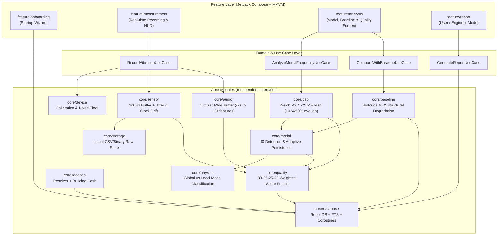

# PhoneSHM: Citizen-Scale Android Structural Health Monitoring (SHM) Platform
## Master Implementation Plan & Production Blueprint (v1.2 Citizen-Scale Platform)

> [!NOTE]
> **Project Goal:** Build `PhoneSHM`, a sovereign, citizen-scale Android native structural monitoring platform (`/data/data/com.termux/files/home/play-ground/ronin_shm`). The app records building vibrations at 100Hz via native accelerometer with precision clock jitter and drift tracking (`sampleJitterStdMs`, `clockDriftPpm`), processes raw signals through a multi-stage DSP pipeline computing separate 3-axis + magnitude **Welch's Method PSD** ($1024$ FFT size / $10.24\text{s}$ physical window, $50\%$ overlap), enforces structural plausibility (`GLOBAL_MODE` vs `LOCAL_MODE` vs `SENSOR_ARTIFACT` in `core/physics`), tracks historical structural degradation against reference baselines (`core/baseline`), tracks adaptive peak persistence across windows, captures pre/post vibration acoustic context via a privacy-preserving circular RAM buffer (`-2s` to `+3s` feature extraction, zero raw audio storage), and scores measurement quality across 4 weighted factors.

---

## 1. Executive Summary & Architectural Core Principles

To ensure clean separation of concerns and prevent architecture degradation across complex sensor, signal processing, physics domain rules, baseline comparison, database, ML, and UI layers, we strictly follow the **Milestone-Based Clean Architecture** rules:
1. **No Premature Optimization:** Implement each phase independently and thoroughly test before moving to the next.
2. **Strict Module Isolation:** UI (`feature/*`) must never directly interact with DSP (`core/dsp`) or raw sensors (`core/sensor`). All interaction flows via Domain Use Cases and Repository interfaces.
3. **Raw Data vs. Analysis Separation:** Room Database (`core/database`) stores **only** session metadata, analysis results (`ModalAnalysisResult`, `SpectrumResult` summary), baseline histories (`BaselineProfile`), and quality scores. Raw high-frequency sensor buffers ($x, y, z$ acceleration @ 100Hz) are streamed directly to binary/CSV local filesystem storage (`File Storage`) to prevent database bloat.
4. **Domain Physics & Historical Baseline Separation:** Mathematical FFT/PSD calculations (`core/dsp`) and peak finding (`core/modal`) are strictly separated from physical structural engineering rules (`core/physics`) and longitudinal historical tracking (`core/baseline`). `core/physics` classifies whether a frequency is a global structural mode vs local structural vibration vs sensor artifact without hard-rejecting complex dynamics.
5. **Interface & Test Driven:** Every `core/*` engine (`SensorManager`, `DeviceCapability`, `DSP Engine`, `PhysicsEngine`, `BaselineEngine`, `ModalAnalyzer`, `QualityScoreEngine`, `AudioContextModule`) exposes a clean Kotlin interface backed by deterministic unit and validation tests.

### High-Level System Architecture Diagram



---

## 2. Research-Grade MVP Execution Order

Per our citizen-scale monitoring architecture, we execute implementation in the following strict order where session data naturally carries essential location, capability, baseline, and calibration context at every step:

| Phase | Target Module | Core Responsibility & Architectural Highlights |
| :--- | :--- | :--- |
| **Phase 0** | Project Foundation | Clean Modular Setup (`app`, `core/device`, `core/physics`, `core/baseline`, `core/sensor`, `core/dsp`, `core/modal`, `core/quality`, `core/location`, `core/audio`, `core/database`, `core/storage`, `feature/*`) & Gradle build scripts |
| **Phase 1** | Startup Wizard & Profile | Room profiles (`BuildingProfile`, `MeasurementProfile`), building material/floor selection UI |
| **Phase 2** | Location System | Multi-source `LocationResolver` with `building_hash` crowdsource ID, map confirmation, and privacy tiers |
| **Phase 3** | Sensor Acquisition Engine | 100Hz Coroutine buffer, local binary/CSV filesystem storage, clock jitter tracking (`sampleJitterStdMs`), and **Sensor Timestamp Drift (`clockDriftPpm`)** |
| **Phase 4** | DSP Engine | **Separate X/Y/Z + Magnitude Welch PSD** ($1024$ FFT size / $10.24\text{s}$ window at $100\text{Hz}$ or $2048$ / $20.48\text{s}$ physical window without zero-padding distortion, $50\%$ overlap) |
| **Phase 5** | Modal & Physics Engine | $f_0$ fundamental frequency detection, **Adaptive Peak Persistence Tracking** across windows (`± max(1%, Δf * 2)`), and **Frequency Classification (`GLOBAL_MODE`, `LOCAL_MODE`, `SENSOR_ARTIFACT`)** |
| **Phase 6** | Baseline Manager Engine | Longitudinal historical tracking (`BaselineProfile`), comparing current $f_0$ vs historical `$meanF0 ± stdF0$` to detect structural shift (`-1.5%`) |
| **Phase 7** | Quality Score Engine | 4-factor scoring fusion (`Sensor 30%`, `Noise 25%`, `Coupling 25%` based on gravity vector stability, `Frequency Stability 20%`) |
| **Phase 8** | Report System | Citizen Science summary report ($f_0$, baseline comparison, confidence, quality) vs Engineer Mode interactive FFT/PSD charts |
| **Phase 9** | Audio Context Module | **Circular RAM Audio Buffer** maintaining last $5\text{s}$ in memory, capturing `-2s to +3s` acoustic features around vibration trigger without raw storage |
| **Phase 10** | Advanced SHM | Multi-axis FDD (Frequency Domain Decomposition 3-axis cross-spectral matrix SVD) & SSI-COV state-space modal identification |

---

## 3. Detailed Module Specifications & Key Interfaces

### `core/device` — Calibration & Device Capability Engine
Evaluates sensor hardware suitability and noise floor before measurement.

```kotlin
package com.ronin.phoneshm.core.device

enum class SensorQualityTier { RESEARCH_GRADE, GOOD, FAIR, UNSUITABLE }

data class DeviceCapabilityReport(
    val deviceModel: String,        // e.g., "Mi11Lite5GNE"
    val sensorVendor: String,       // e.g., "Bosch"
    val maxSupportedSampleRateHz: Int, // e.g., 200
    val estimatedNoiseFloorMg: Float,
    val accelerometerBias: FloatArray, // [xBias, yBias, zBias]
    val qualityTier: SensorQualityTier
)

interface DeviceCapabilityEngine {
    suspend fun inspectDeviceCapabilities(): DeviceCapabilityReport
    suspend fun runZeroVelocityCalibration(durationSec: Int = 5): FloatArray
}
```

---

### `core/physics` — Domain Rules & Modal Classification
Instead of hard-rejecting frequencies outside simple boundaries, classifies whether a candidate frequency represents a global structural mode, a local floor/member vibration, or a sensor artifact.

```kotlin
package com.ronin.phoneshm.core.physics

import com.ronin.phoneshm.core.database.model.BuildingProfile

enum class FrequencyClassification {
    GLOBAL_MODE,     // Primary structural resonance (e.g. 3Hz - 15Hz on RC building)
    LOCAL_MODE,      // Local slab/floor/element vibration (e.g. 35Hz on high-stiffness span)
    SENSOR_ARTIFACT, // Electrical/clock harmonic or zero-velocity spike
    UNKNOWN
}

data class PlausibilityClassificationResult(
    val classification: FrequencyClassification,
    val confidence: Double,
    val explanation: String
)

interface PhysicsRulesEngine {
    fun classifyFrequency(f0Hz: Double, prominence: Float, profile: BuildingProfile): PlausibilityClassificationResult
}
```

---

### `core/baseline` — Historical Structural Baseline Manager
Tracks longitudinal health across multiple measurements for the exact `buildingHash`.

```kotlin
package com.ronin.phoneshm.core.baseline

data class BaselineProfile(
    val buildingHash: String,
    val meanF0Hz: Double,
    val stdF0Hz: Double,
    val measurementCount: Int,
    val lastUpdatedAt: Long
)

data class BaselineComparisonResult(
    val currentF0Hz: Double,
    val baselineProfile: BaselineProfile?,
    val percentageShift: Double, // e.g. -1.5% shift in fundamental frequency
    val isAnomaly: Boolean,      // True if shift exceeds 2 * stdF0 or preset safety threshold
    val diagnosticSummary: String
)

interface BaselineManagerEngine {
    suspend fun getOrCreateBaseline(buildingHash: String): BaselineProfile?
    suspend fun compareWithBaseline(buildingHash: String, currentF0Hz: Double): BaselineComparisonResult
    suspend fun updateBaselineWithSession(buildingHash: String, currentF0Hz: Double, qualityScorePct: Int)
}
```

---

### `core/sensor` & `core/storage` — Sensor Acquisition, Jitter & Clock Drift
Records exact timestamp jitter and clock drift (in parts per million `PPM`) to detect hardware clock degradation.

```kotlin
package com.ronin.phoneshm.core.sensor

import kotlinx.coroutines.flow.Flow

data class AccelerationSample(
    val timestampNs: Long, // Monotonic nanosecond timestamp
    val x: Float,
    val y: Float,
    val z: Float
)

data class MeasurementSessionMetadata(
    val sessionId: String,
    val measurementProfileId: String,
    val deviceCapabilityReportId: String,
    val targetDurationSeconds: Int,
    val targetSampleRateHz: Int = 100,
    val actualAverageSampleRateHz: Float,
    val sampleJitterStdMs: Float, // e.g., 2.1 ms standard deviation
    val clockDriftPpm: Float,     // e.g., Clock drift vs system clock in parts per million
    val rawStorageFileUri: String // Filesystem path to raw CSV/binary buffer
)

interface VibrationSensorEngine {
    fun startStreaming(targetHz: Int = 100): Flow<AccelerationSample>
    suspend fun recordSession(sessionId: String, profileId: String, durationSec: Int = 30): MeasurementSessionMetadata
}
```

---

### `core/dsp` — Separate X/Y/Z + Magnitude Welch PSD
Preserves directional modal information (`PSD_X`, `PSD_Y`, `PSD_Z`) alongside magnitude (`PSD_Mag`) using physical time windowing (`1024` samples = `10.24s` physical window at `100Hz`).

```kotlin
package com.ronin.phoneshm.core.dsp

data class WelchPsdParameters(
    val fftSize: Int = 1024,              // Exactly 10.24 sec physical window at 100Hz (deltaF = 0.097 Hz)
    val windowType: String = "HANNING",
    val overlapPercentage: Float = 0.50f, // 50% overlap (5.12 sec step)
    val averageSegmentsCount: Int
)

data class Peak(
    val frequencyHz: Float,
    val powerMagnitude: Float,
    val prominence: Float
)

data class AxisPsdResult(
    val frequencies: FloatArray,
    val powerSpectralDensity: FloatArray,
    val peaks: List<Peak>
)

data class MultiAxisSpectrumResult(
    val psdX: AxisPsdResult,
    val psdY: AxisPsdResult,
    val psdZ: AxisPsdResult,
    val psdMagnitude: AxisPsdResult, // a_t = sqrt(x^2 + y^2 + z^2)
    val parameters: WelchPsdParameters
)

interface DspEngine {
    fun removeGravityAndDetrend(samples: List<AccelerationSample>): List<AccelerationSample>
    fun highPassFilter(signal: FloatArray, sampleRateHz: Float, cutoffHz: Float = 0.5f): FloatArray
    fun applyHanningWindow(windowSegment: FloatArray): FloatArray
    
    /**
     * Executes Welch's Method separately for X, Y, Z axes and Magnitude without zero-padding distortion.
     */
    fun calculateMultiAxisWelchPsd(samples: List<AccelerationSample>, sampleRateHz: Float, params: WelchPsdParameters = WelchPsdParameters(averageSegmentsCount = 1)): MultiAxisSpectrumResult
}
```

---

### `core/modal` — Adaptive Peak Persistence & Modal Analysis
Enforces adaptive tolerance matching: `tolerance = max(1%, deltaF * 2)` across sliding time windows.

```kotlin
package com.ronin.phoneshm.core.modal

import com.ronin.phoneshm.core.dsp.MultiAxisSpectrumResult
import com.ronin.phoneshm.core.physics.PlausibilityClassificationResult

data class ModalAnalysisResult(
    val fundamentalFrequencyHz: Double, // Primary f0 candidate
    val dominantAxis: String,           // "X", "Y", "Z", or "MAGNITUDE"
    val confidence: Double,             // Prominence and SNR score (0.0 to 1.0)
    val persistence: Double,            // Percentage of windows containing peak within adaptive tolerance
    val adaptiveToleranceHz: Double,    // e.g. max(0.01 * f0, deltaF * 2)
    val classification: PlausibilityClassificationResult,
    val dominantPeaksTable: List<Pair<Double, Double>>
)

interface ModalAnalyzer {
    fun analyzeMultiAxisSpectrum(
        spectrum: MultiAxisSpectrumResult,
        slidingWindowSpectra: List<MultiAxisSpectrumResult>,
        plausibilityClassification: PlausibilityClassificationResult
    ): ModalAnalysisResult
}
```

---

### `core/audio` — Circular RAM Buffer Acoustic Classifier
Maintains a rolling 5-second circular RAM buffer to capture pre/post event acoustic features (`-2s` to `+3s`) around vibration triggers without saving raw audio files.

```kotlin
package com.ronin.phoneshm.core.audio

data class AudioContextResult(
    val eventLabel: String,     // e.g. "vehicle_passing", "heavy_machinery", "quiet"
    val confidence: Double,     // e.g. 0.91
    val rmsEnergy: Float,
    val spectralCentroidHz: Float,
    val lowFrequencyEnergyRatio: Float,
    val captureWindowSec: String = "-2.0s to +3.0s"
)

interface AudioContextModule {
    /**
     * Starts continuous low-latency circular RAM buffer (last 5 seconds in memory).
     */
    fun startCircularBuffer()
    
    /**
     * Triggers feature extraction on the buffered -2s to +3s window upon detecting a vibration transient,
     * computes RMS/Centroid features, categorizes source, and flushes PCM buffer immediately.
     */
    suspend fun extractFeaturesAroundTrigger(): AudioContextResult
}
```

---

### `core/quality` — Measurement Quality Engine (Weighted Fusion)
Aggregates all sensor, DSP, audio, and coupling factors into a deterministic score.

```kotlin
package com.ronin.phoneshm.core.quality

import com.ronin.phoneshm.core.audio.AudioContextResult
import com.ronin.phoneshm.core.device.DeviceCapabilityReport
import com.ronin.phoneshm.core.modal.ModalAnalysisResult
import com.ronin.phoneshm.core.sensor.MeasurementSessionMetadata

data class MeasurementQualityReport(
    val totalScorePct: Int,             // 0-100%
    val sensorStabilityScore: Int,      // Max 30% (jitterStd < 2ms & clockDriftPpm < 100)
    val noiseLevelScore: Int,           // Max 25% (audio event classification & acoustic RMS)
    val couplingQualityScore: Int,      // Max 25% (gravity vector variance & high-frequency noise ratio)
    val frequencyStabilityScore: Int,   // Max 20% (adaptive peak persistence >= 90%)
    val qualityCategory: String,        // "RESEARCH_GRADE", "GOOD", "FAIR", "UNRELIABLE"
    val diagnosticsExplanation: String
)

interface QualityScoreEngine {
    fun calculateQualityScore(
        session: MeasurementSessionMetadata,
        device: DeviceCapabilityReport,
        audio: AudioContextResult?,
        modal: ModalAnalysisResult
    ): MeasurementQualityReport
}
```

---

## 4. Verification & Validation Strategy

### Automated Unit & Pipeline Tests (`./gradlew testDebugUnitTest`)
1. **Clock Drift & Jitter Verification (`VibrationSensorEngineTest.kt`):**
   - Simulate sensor timestamp series exhibiting `2.1ms` jitter and `150 PPM` clock drift. Verify `MeasurementSessionMetadata` computes drift precisely and passes deductions to `QualityScoreEngine`.
2. **Multi-Axis Welch PSD & Adaptive Persistence (`DspEngineMultiAxisTest.kt`):**
   - Generate synthetic $X, Y, Z$ acceleration signals where $8.17\text{Hz}$ mode exists purely on the $X$-axis and $14.5\text{Hz}$ on the $Y$-axis.
   - Verify `calculateMultiAxisWelchPsd()` preserves both modes on their respective axes (`psdX`, `psdY`) and verifies `persistence` matching under `adaptiveToleranceHz = max(1%, deltaF * 2)`.
3. **Circular RAM Audio Window Verification (`AudioContextModuleTest.kt`):**
   - Feed simulated PCM data into `startCircularBuffer()`. Trigger event at $t=3.0\text{s}$. Verify extracted features accurately represent the exact `[-2s to +3s]` temporal window and that raw buffer is zeroed out after extraction.

### Real-World Field Validation Harness
1. **Battery Restriction Pre-Check:** Before starting any 600s Ambient Baseline Mode recording, verify battery restrictions are disabled for the app (set Battery Saver to "No Restrictions" and enable "Autostart"), especially on Xiaomi/MIUI, Huawei, Oppo, and Vivo devices (prevents OS 200ms sensor duty-cycle throttling after 4 minutes).
2. **Field Comparison Test:** Deploy `PhoneSHM` alongside a professional reference accelerometer on a known reinforced concrete structure.
3. Verify that `PhoneSHM` ($X/Y/Z$ Welch PSD) identifies fundamental frequency $f_0$ within $\pm 0.1\text{Hz}$ of the reference sensor, and that `BaselineManager` logs historical drift accurately across repeated sessions.
